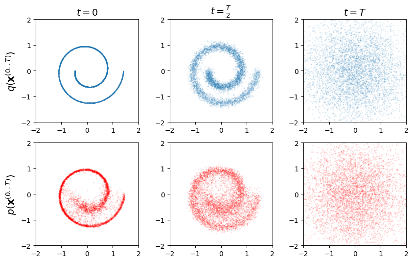
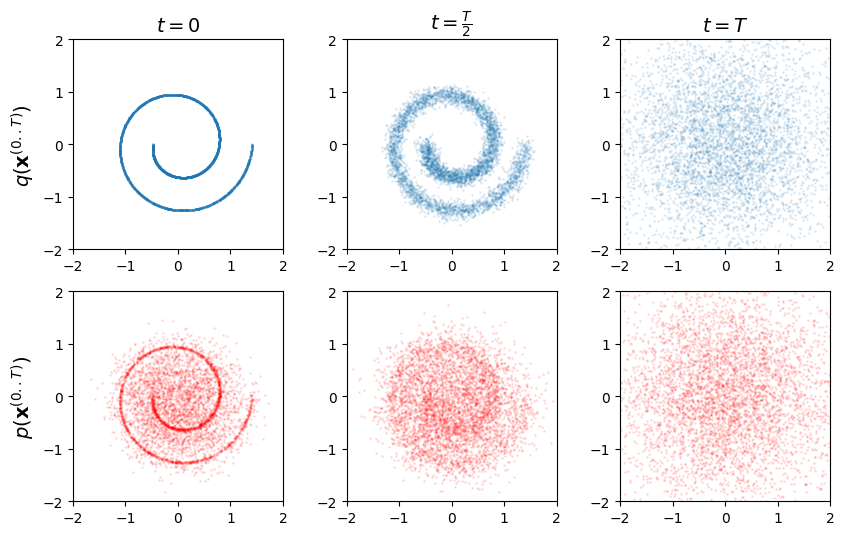

# 1/ Diffusion-Swiss-Rolls

Diffusion model training on Swiss Roll data using two loss functions:
- **KL Divergence Loss:** Encourages the learned distribution to match the true data distribution by minimizing the Kullback-Leibler divergence. This often results in smoother and more structured samples.  
- **MSE Loss:** Minimizes the mean squared error between predicted and true noise, leading to a more direct optimization but potentially less structured diffusion steps. (Faster training time too)  
## Result
| KL Divergence Loss                                                               | MSE Loss                                                                        |
|------------------------------------------------------------------------------------|---------------------------------------------------------------------------------------------|
|  |  |

# 2/ Diffusion-Inpainting
...working...
