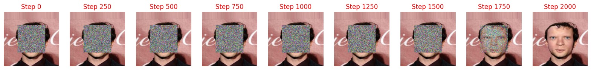

# 1/ Diffusion-Swiss-Rolls

Diffusion model training on Swiss Roll data using two loss functions:
- **KL Divergence Loss:** Encourages the learned distribution to match the true data distribution by minimizing the Kullback-Leibler divergence. This often results in smoother and more structured samples.  
- **MSE Loss:** Minimizes the mean squared error between predicted and true noise, leading to a more direct optimization but potentially less structured diffusion steps. (Faster training time too)  
## Result
| KL Divergence Loss                                                               | MSE Loss                                                                        |
|------------------------------------------------------------------------------------|---------------------------------------------------------------------------------------------|
|  |  |

# 2/ Diffusion-Inpainting

Diffusion model training on [CelebA dataset](https://mmlab.ie.cuhk.edu.hk/projects/CelebA.html) with the goal of reconstructing missing image parts. The model works by progressively denoising corrupted images until the missing parts are restored.

## Result
| Input Image                                                               | Reconstructed Image                                                                        |
|----------------------------------------------------------------------------------|---------------------------------------------------------------------------------------------|
|  |  |
